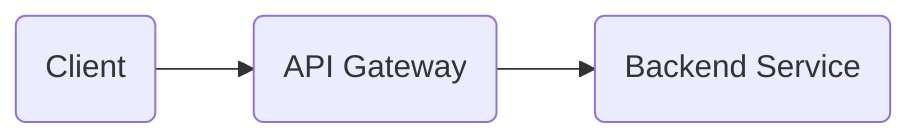

# API Gateway Administrator
API Gateway Serving as the entry point for API requests, responsible for tasks like routing, load balancing, enforce policies like JWT, OAuth2, request and response transformation.

#### Simple Architecture of API Gateway

## List Content
[1. Installation](https://github.com/ikromnurrohim/webmethods-api-gateway-guide/blob/master/installation/README.MD#installation) \
[2. Configuration](https://github.com/ikromnurrohim/webmethods-api-gateway-guide/blob/master/configuration/README.MD) \
[3. Start, Stop and Restart API Gateway](https://github.com/ikromnurrohim/webmethods-api-gateway-guide/blob/master/start-stop-api-gateway/README.MD) \
[4. Basic Debugging](https://github.com/ikromnurrohim/webmethods-api-gateway-guide/blob/master/basic-debuging/README.MD)

## Nice References
[webMethods API Management Basic](https://gist.github.com/ikromnurrohim/24c7c49864a528001dac23f9a57558e9) \
[webMethods API Management Essentials](https://gist.github.com/ikromnurrohim/27ceeccb6a6634921dfb2669703b085f) \
[webMethods API Management Advanced Security](https://gist.github.com/ikromnurrohim/ccb815111c8e4658167e08e6d211a00f) 
